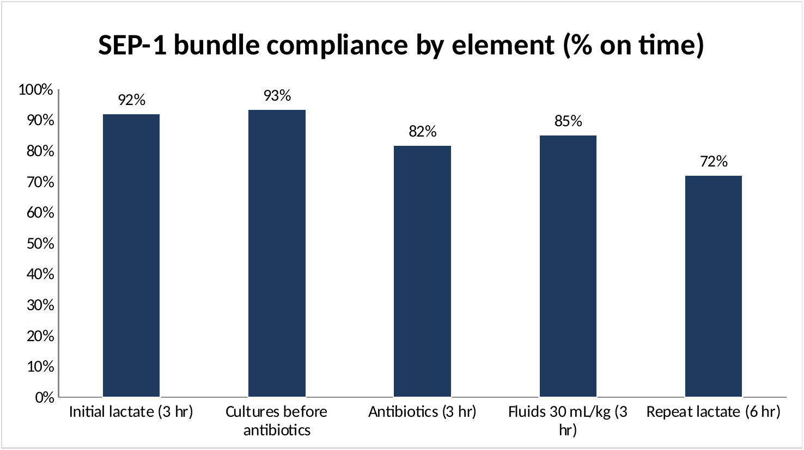
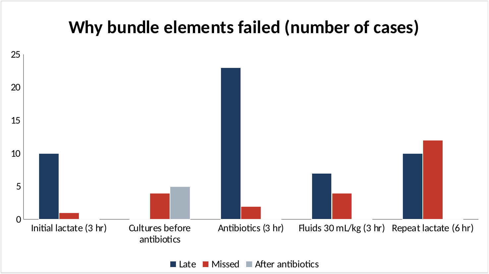

# Sepsis Screening and SEP-1 Bundle Compliance

I'm a registered nurse working toward a career in healthcare analytics. This project screens patients for severe sepsis using CMS SEP-1 criteria, checks whether each bundle element was completed on time, and compares the clinical picture against how each case was coded.

All data is synthetic. No real patient information is used.

## What is SEP-1?

SEP-1, the Severe Sepsis and Septic Shock Management Bundle, is a quality measure from the Centers for Medicare & Medicaid Services (CMS). It looks at whether hospitals complete a set of time-sensitive steps for patients with severe sepsis or septic shock, including drawing a lactate, getting blood cultures before antibiotics, starting antibiotics, and giving IV fluids when needed.

## Overview

The project has four scripts.

`sepsis_screener_classes.py` screens a patient the same way a nurse would at the bedside. It checks for infection, counts SIRS criteria, looks for organ dysfunction, and classifies the patient as no sepsis, sepsis, or severe sepsis. It then lists the findings behind that result, the next action, and the bundle elements that apply.

`generate_sepsis_data.py` creates 300 encounters across four units from January through June 2026. Severe sepsis cases include a time zero, a timestamp for each bundle element, and diagnosis codes. I added realistic misses, like late antibiotics, cultures drawn after antibiotics, and missing severity codes, so the reports have something to catch.

`sepsis_compliance.py` loads the encounters, screens each one, and checks every bundle element for the severe sepsis cases. It reports compliance overall, by element with the reason each case failed, and by unit.

`sepsis_documentation_gaps.py` compares each patient's criteria with their codes. It flags two kinds of cases: query opportunities, where the criteria are met but the condition wasn't coded, and clinical validation reviews, where the condition was coded but the criteria aren't met. Codes come from provider documentation, so these are cases for CDI to review, not codes to change automatically.

`sepsis_results.xlsx` is an Excel version of the results. It has the bundle results for every severe sepsis case, summary tables built with COUNTIF and COUNTIFS formulas, and charts for compliance by element, failure reasons, compliance by unit, and documentation gaps.

## Criteria

The rules follow SEP-1 for non-pregnant adults.

Sepsis: known or suspected infection plus 2 or more SIRS criteria (temperature above 100.9 F or below 96.8 F, HR above 90, RR above 20, WBC above 12,000 or below 4,000, or bands above 10%).

Severe sepsis: sepsis plus at least one sign of organ dysfunction (SBP below 90 or MAP below 65, lactate above 2, creatinine above 2.0, platelets below 100,000 or INR above 1.5, bilirubin above 2).

Bundle elements: initial lactate, blood cultures before antibiotics, broad-spectrum antibiotics, a 30 mL/kg fluid bolus for hypotension or a lactate of 4 or higher, and a repeat lactate if the first was above 2.

I haven't added septic shock or vasopressors yet, or the organ dysfunction signs that need more than one reading. The nurse actions are kept general because escalation steps differ between hospitals, and the bundle timing is simpler than the full SEP-1 specifications.

## Design

`Patient` holds the clinical data and `SepsisProtocol` holds the rules. Keeping them separate means I can add other protocols later and run them on the same patients.

Thresholds like MAP and lactate are named constants, so changing a standard takes one edit.

The screener comes with six test patients, each written to hit a different path through the logic, from no infection to a severe case that needs the full bundle.

## Running the project

```
python generate_sepsis_data.py
python sepsis_screener_classes.py
python sepsis_compliance.py
python sepsis_documentation_gaps.py
```

The first creates `sepsis_encounters.csv`. The second screens the six test patients. The third and fourth print the compliance and documentation gap reports.

## Results

### Bundle compliance

137 of the 300 encounters met severe sepsis criteria. Overall bundle compliance was 58%.

| Element | Compliance |
|---|---|
| Cultures before antibiotics | 93% |
| Initial lactate (3 hr) | 92% |
| Fluids 30 mL/kg (3 hr) | 85% |
| Antibiotics (3 hr) | 82% |
| Repeat lactate (6 hr) | 72% |

Repeat lactate was the weakest element. Most failures were late rather than missed, and antibiotics had the most late cases.





These charts come from the Excel workbook (`sepsis_results.xlsx`).

These numbers come from how I set up the generator, not from real performance. Units were assigned at random, so the differences between them are just variation in small samples.

### How this compares to real hospitals

Real SEP-1 compliance varies a lot between hospitals. In 2017 data, hospitals averaged about 49%, with most falling somewhere between 30% and 70% [1]. State averages ranged from 9% to 63%, and New York came in at 47% [2]. Safety-net and non-safety-net hospitals scored about the same, 48% and 50% [3]. Performance has improved since then, and by 2025 some hospitals were scoring 95% or higher [4]. My synthetic result of 58% falls within the realistic range. Current hospital-level scores are available in CMS's public Timely and Effective Care dataset [5].

### Documentation gaps

58 encounters were flagged. 46 were query opportunities, and the most common was severe sepsis criteria met but coded as sepsis only (27 cases). The other 12 were clinical validation reviews, where sepsis or severe sepsis was coded without the criteria to support it.

## Next steps

Next, I want to add the full SEP-1 time windows.

This project is for learning and portfolio purposes only and isn't a clinical tool.

## References

Centers for Medicare & Medicaid Services. Specifications Manual for National Hospital Inpatient Quality Measures, SEP-1: Severe Sepsis and Septic Shock: Management Bundle. QualityNet. https://qualitynet.cms.gov

Centers for Medicare & Medicaid Services, Hospital Inpatient Quality Reporting Program. SEP-1 presentation slides, March 2023. Quality Reporting Center. https://www.qualityreportingcenter.com/globalassets/iqr-2023-events/iqr32423/march2023_sep_1_npc_final508.pdf

### Real-world comparison sources

[1] Barbash IJ, et al. National Performance on the Medicare SEP-1 Sepsis Quality Measure. Critical Care Medicine, 2019. https://pubmed.ncbi.nlm.nih.gov/30585827/

[2] State-level hospital compliance with and performance in the Centers for Medicare & Medicaid Services' Early Management Severe Sepsis and Septic Shock Bundle. Critical Care, 2019. https://pmc.ncbi.nlm.nih.gov/articles/PMC6421646

[3] Study comparing SEP-1 compliance at safety-net and non-safety-net hospitals. Journal of Critical Care, 2019. https://pmc.ncbi.nlm.nih.gov/articles/PMC6901718/

[4] Becker's Hospital Review. 25 hospitals with the highest SEP-1 scores: CMS. https://www.beckershospitalreview.com/quality/patient-safety-outcomes/25-hospitals-with-the-highest-sep-1-scores-cms/

[5] Centers for Medicare & Medicaid Services. Timely and Effective Care - Hospital. Provider Data Catalog. https://data.cms.gov/provider-data/dataset/yv7e-xc69
